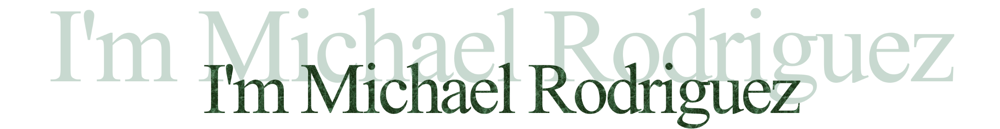

 

    

<h3 align="center">
    I am a cybersecurity student with an emphasis in computer science. With all of my programs, my goal is to learn cybersecurity concepts and/or improve my programming skills.
</h3>

<h1 align="center"> 🖥️ Statistics</h1>

  

<h1 align="center"> ⚒️ Languages, Frameworks, Tools, and Operating Systems</h1>

    

     

